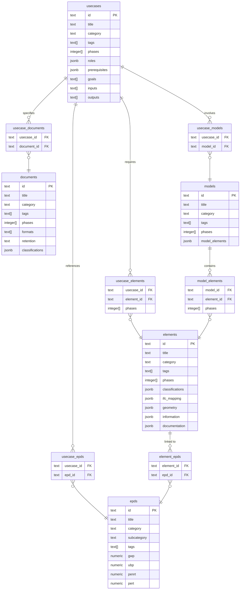

# KBOB Fachdatenkatalog – Database Schema Design

## Project Overview

**Repository**: [kbob-fdk](https://github.com/davras5/kbob-fdk)
**Database**: PostgreSQL on Supabase
**Purpose**: Interactive catalog for BIM requirements, classifications, and information specifications for building elements and documents in Switzerland.
**Validation Sources**: VDI 2552 Blatt 12.1/12.2, ISO 19650, KBOB/IPB Bauwerksdokumentation, IFC 4.3

---

## Entity Relationship Overview

### Core Tables

| Entity | Primary Key | Has Phases | Description |
|--------|-------------|------------|-------------|
| `elements` | `id` (text) | ✓ | Physical building components with LOG/LOI requirements |
| `documents` | `id` (text) | ✓ | Project documentation types per KBOB/IPB standard |
| `usecases` | `id` (text) | ✓ | Standardized BIM processes per VDI 2552 |
| `models` | `id` (text) | ✓ | BIM discipline and coordination model definitions |
| `epds` | `id` (text) | ✗ | Environmental impact data (KBOB Ökobilanzdaten) |

### Junction Tables (Foreign Keys)

| Junction Table | PK | FK1 | FK2 | Description |
|----------------|----|----|-----|-------------|
| `usecase_elements` | `(usecase_id, element_id)` | `usecases.id` | `elements.id` | Use case → required elements |
| `usecase_documents` | `(usecase_id, document_id)` | `usecases.id` | `documents.id` | Use case → required documents |
| `usecase_models` | `(usecase_id, model_id)` | `usecases.id` | `models.id` | Use case → involved models |
| `usecase_epds` | `(usecase_id, epd_id)` | `usecases.id` | `epds.id` | Use case → referenced EPDs |
| `model_elements` | `(model_id, element_id)` | `models.id` | `elements.id` | Model → contained elements |
| `element_epds` | `(element_id, epd_id)` | `elements.id` | `epds.id` | Element → linked EPDs |

> **Note on phases:** EPD is the only entity without `phases` as environmental data is phase-neutral reference data.



---

## Junction Tables (M:N Relationships)

Junction tables implement the many-to-many relationships defined in the conceptual model per ISO 19650.

| Junction Table | Relationship | Description |
|----------------|--------------|-------------|
| `usecase_elements` | UseCase ↔ Element | Use case defines which elements are required with specific LOG/LOI |
| `usecase_documents` | UseCase ↔ Document | Use case specifies required deliverables |
| `usecase_models` | UseCase ↔ Model | Use case involves contributions from discipline models |
| `usecase_epds` | UseCase ↔ EPD | Sustainability use cases reference environmental data |
| `model_elements` | Model ↔ Element | Models contain/reference element types |
| `element_epds` | Element ↔ EPD | Elements linked to environmental product declarations |

### usecase_elements

Links use cases to required elements with phase-specific requirements.

| Column | Type | Constraints | Description |
|--------|------|-------------|-------------|
| `usecase_id` | `text` | `NOT NULL, REFERENCES usecases(id) ON DELETE CASCADE` | Reference to use case |
| `element_id` | `text` | `NOT NULL, REFERENCES elements(id) ON DELETE CASCADE` | Reference to element |
| `phases` | `integer[]` | `CHECK (phases <@ ARRAY[1,2,3,4,5])` | Phase-specific applicability (overrides element phases) |
| `log_level` | `text` | | Required LOG level for this use case |
| `loi_level` | `text` | | Required LOI level for this use case |
| `notes` | `text` | | Additional requirements or notes |

**Primary Key:** `(usecase_id, element_id)`

### usecase_documents

Links use cases to required document deliverables.

| Column | Type | Constraints | Description |
|--------|------|-------------|-------------|
| `usecase_id` | `text` | `NOT NULL, REFERENCES usecases(id) ON DELETE CASCADE` | Reference to use case |
| `document_id` | `text` | `NOT NULL, REFERENCES documents(id) ON DELETE CASCADE` | Reference to document |
| `required` | `boolean` | `NOT NULL DEFAULT true` | Whether document is mandatory |
| `notes` | `text` | | Additional requirements or notes |

**Primary Key:** `(usecase_id, document_id)`

### usecase_models

Links use cases to involved BIM models.

| Column | Type | Constraints | Description |
|--------|------|-------------|-------------|
| `usecase_id` | `text` | `NOT NULL, REFERENCES usecases(id) ON DELETE CASCADE` | Reference to use case |
| `model_id` | `text` | `NOT NULL, REFERENCES models(id) ON DELETE CASCADE` | Reference to model |
| `role` | `text` | | Model's role in the use case (input, output, reference) |
| `notes` | `text` | | Additional requirements or notes |

**Primary Key:** `(usecase_id, model_id)`

### usecase_epds

Links sustainability use cases to environmental product data.

| Column | Type | Constraints | Description |
|--------|------|-------------|-------------|
| `usecase_id` | `text` | `NOT NULL, REFERENCES usecases(id) ON DELETE CASCADE` | Reference to use case |
| `epd_id` | `text` | `NOT NULL, REFERENCES epds(id) ON DELETE CASCADE` | Reference to EPD |
| `notes` | `text` | | Additional context or notes |

**Primary Key:** `(usecase_id, epd_id)`

### model_elements

Links models to contained element types with phase-specific inclusion.

| Column | Type | Constraints | Description |
|--------|------|-------------|-------------|
| `model_id` | `text` | `NOT NULL, REFERENCES models(id) ON DELETE CASCADE` | Reference to model |
| `element_id` | `text` | `NOT NULL, REFERENCES elements(id) ON DELETE CASCADE` | Reference to element |
| `phases` | `integer[]` | `CHECK (phases <@ ARRAY[1,2,3,4,5])` | Phases where element appears in model |
| `notes` | `text` | | Additional context |

**Primary Key:** `(model_id, element_id)`

### element_epds

Links elements to environmental product declarations for LCA.

| Column | Type | Constraints | Description |
|--------|------|-------------|-------------|
| `element_id` | `text` | `NOT NULL, REFERENCES elements(id) ON DELETE CASCADE` | Reference to element |
| `epd_id` | `text` | `NOT NULL, REFERENCES epds(id) ON DELETE CASCADE` | Reference to EPD |
| `quantity_formula` | `text` | | Formula for calculating quantity from element |
| `notes` | `text` | | Additional context |

**Primary Key:** `(element_id, epd_id)`

---

## Shared Attributes

All five core entities share a common set of attributes for identification, versioning, and discoverability.

### Common Attributes (All Entities)

| Column | Type | Constraints | Description |
|--------|------|-------------|-------------|
| `id` | `text` | `PRIMARY KEY` | Unique identifier (entity-specific pattern) |
| `version` | `text` | `NOT NULL` | Version indicator for change tracking |
| `last_change` | `date` | `NOT NULL` | Date of last modification (ISO 8601) |
| `title` | `text` | `NOT NULL` | Human-readable display name |
| `image` | `text` | | Visual representation reference (URL or path) |
| `category` | `text` | `NOT NULL` | Primary grouping (entity-specific vocabulary) |
| `description` | `text` | | Detailed explanation of purpose and scope |
| `tags` | `text[]` | `NOT NULL, min. 1` | Anwendungsfeld keywords per VDI 2552 Blatt 12.2 |
| `created_at` | `timestamptz` | `NOT NULL DEFAULT now()` | Record creation timestamp |
| `updated_at` | `timestamptz` | `NOT NULL DEFAULT now()` | Record last update timestamp (auto-updated) |

### Phase-Dependent Entities

All entities **except EPD** include lifecycle phases:

| Column | Type | Constraints | Description |
|--------|------|-------------|-------------|
| `phases` | `integer[]` | `CHECK (phases <@ ARRAY[1,2,3,4,5])` | Applicable lifecycle phases (1-5) |

> **Note:** EPD contains phase-neutral reference data (environmental indicators don't vary by project phase).

### ID Patterns

| Entity | Pattern | Example | Regex |
|--------|---------|---------|-------|
| elements | `e{n}` | e1, e81 | `^e[0-9]+$` |
| documents | `{O\|K\|B\|V}{nnnnn}` | O01001, K02003 | `^[OKBV][0-9]{5}$` |
| usecases | `uc{nnn}` | uc000, uc280 | `^uc[0-9]{3}$` |
| models | `m{n}` | m1, m10 | `^m[0-9]+$` |
| epds | `kbob-{nn}-{nnn}` | kbob-01-042 | `^kbob-[0-9]{2}-[0-9]{3}$` |

---

## Entity-Specific Attributes

### elements

Physical building components with geometry (LOG), information (LOI), and documentation requirements.

| Column | Type | Constraints | Description |
|--------|------|-------------|-------------|
| `geometry` | `jsonb` | `NOT NULL DEFAULT '[]'` | LOG specifications per phase |
| `information` | `jsonb` | `NOT NULL DEFAULT '[]'` | LOI specifications per phase |
| `documentation` | `jsonb` | `DEFAULT '[]'` | Required documents per phase |
| `classifications` | `jsonb` | `DEFAULT '{}'` | Multi-system codes (eBKP-H, DIN 276, Uniformat II) |
| `ifc_mapping` | `jsonb` | `DEFAULT '[]'` | Mappings to IFC classes and authoring tools |

**Category values:** Architektur, Tragwerk, Gebäudetechnik HLKS, Gebäudetechnik Elektro, Ausbau, Umgebung, Brandschutz, Transportanlagen

---

### documents

Project documentation types with format requirements and retention policies per KBOB/IPB Bauwerksdokumentation.

| Column | Type | Constraints | Description |
|--------|------|-------------|-------------|
| `formats` | `text[]` | `NOT NULL` | Acceptable file formats (PDF-A, Office-Format, DWG, IFC, etc.) |
| `retention` | `text` | | Retention policy (5 Jahre, 12 Jahre, bis Ersatz, etc.) |
| `classifications` | `jsonb` | `DEFAULT '{}'` | Optional classification codes (GEFMA, SIA, etc.) |

**Category values:** Organisation, Verträge und Kosten, Konzepte und Beschriebe, Visualisierungen

---

### usecases

Standardized BIM processes with roles, responsibilities, and quality criteria per VDI 2552 Blatt 12.1/12.2.

| Column | Type | Constraints | Description |
|--------|------|-------------|-------------|
| `definition` | `text` | `NOT NULL` | Formal definition of the use case |
| `goals` | `text[]` | `NOT NULL, min. 1` | Objectives |
| `inputs` | `text[]` | `NOT NULL DEFAULT '{}'` | Required inputs and preconditions |
| `outputs` | `text[]` | `NOT NULL DEFAULT '{}'` | Deliverables and results |
| `roles` | `jsonb` | `NOT NULL DEFAULT '[]'` | RACI responsibility matrix |
| `prerequisites` | `jsonb` | `NOT NULL DEFAULT '{}'` | Requirements for client and contractor |
| `implementation` | `text[]` | `NOT NULL DEFAULT '{}'` | Implementation steps |
| `quality_criteria` | `text[]` | `NOT NULL DEFAULT '{}'` | Acceptance and quality criteria |
| `standards` | `text[]` | `DEFAULT '{}'` | Referenced standards (SIA, ISO, VDI) |
| `process_url` | `text` | | Link to BPMN process diagram |
| `examples` | `jsonb` | `DEFAULT '[]'` | Example implementations |
| `practice_example` | `jsonb` | | Real-world practice example |

**Category values:** Per VDI 2552 Blatt 12.2 Anwendungsfeld (22 values – see Enumerations)

---

### models

BIM model types including discipline models, coordination models, and special-purpose models.

| Column | Type | Constraints | Description |
|--------|------|-------------|-------------|
| `elements` | `jsonb` | `NOT NULL DEFAULT '[]'` | Element types contained in model |

**Category values:** Fachmodelle, Koordination, Spezialmodelle, Bestand

---

### epds

Environmental impact data for construction materials per KBOB Ökobilanzdaten.

> **Note:** No `phases` column – EPD data is phase-neutral reference data.

| Column | Type | Constraints | Description |
|--------|------|-------------|-------------|
| `subcategory` | `text` | `NOT NULL` | Specific material group |
| `unit` | `text` | `NOT NULL` | Functional/reference unit (kg, m², m³, kWh, etc.) |
| `gwp` | `numeric` | `NOT NULL, >= 0` | Global Warming Potential (kg CO₂-eq) |
| `ubp` | `numeric` | `NOT NULL, >= 0` | Umweltbelastungspunkte / Swiss ecological scarcity (Points) |
| `penrt` | `numeric` | `NOT NULL, >= 0` | Primary Energy Non-Renewable Total (MJ) |
| `pert` | `numeric` | `NOT NULL, >= 0` | Primary Energy Renewable Total (MJ) |
| `density` | `text` | | Material density |
| `biogenic_carbon` | `numeric` | | Biogenic carbon content |

**Category values:** Baumaterialien, Energie, Gebäudetechnik, Transporte

---

## JSONB Structures

### Element: geometry (LOG)

```json
[
  {
    "name": "Symbol",
    "desc": "Schematische Darstellung des Elements zur Visualisierung in Plänen",
    "phases": [3]
  },
  {
    "name": "Länge",
    "desc": "Ausdehnung des Elements in Längsrichtung in Metern",
    "phases": [4, 5]
  }
]
```

| Field | Type | Required | Description |
|-------|------|----------|-------------|
| `name` | string | ✓ | Geometry property name |
| `desc` | string | ✓ | Description of the requirement |
| `phases` | integer[] | ✓ | Phases where this geometry is required (1-5) |

### Element: information (LOI)

```json
[
  {
    "name": "IFC-Klasse (a)",
    "desc": "IFC-Entitätsklasse des Elements (z.B. IfcWall, IfcDoor)",
    "format": "String",
    "list": false,
    "phases": [3, 4, 5],
    "ifc": "IfcRoot.is_a()"
  }
]
```

| Field | Type | Required | Description |
|-------|------|----------|-------------|
| `name` | string | ✓ | Property name |
| `desc` | string | ✓ | Description and purpose |
| `format` | enum | ✓ | Data type: Real, String, Boolean, Integer, Date |
| `list` | boolean | ✓ | Whether value comes from controlled vocabulary |
| `phases` | integer[] | ✓ | Phases where this information is required |
| `ifc` | string | | IFC PropertySet and property reference |

### Element: ifc_mapping

```json
[
  {
    "element": "Rollladenmotor",
    "ifc": "IfcActuator.ELECTRICACTUATOR",
    "revit": "Revit: Spezialisierte Ausrüstung",
    "archicad": null
  }
]
```

| Field | Type | Required | Description |
|-------|------|----------|-------------|
| `element` | string | ✓ | Element variant description |
| `ifc` | string | ✓ | IFC class and predefined type (IFC 4.3 schema) |
| `revit` | string | | Revit family/category mapping |
| `archicad` | string | | ArchiCAD object mapping |

### Element/Document: classifications

```json
{
  "eBKP-H": ["C02 – Wandkonstruktion", "D02 – Gebäudeautomation"],
  "DIN276": ["KG 466 – Hydraulikanlagen"],
  "Uniformat II 2010": ["D8010.10 – Integrated Automation Control"]
}
```

| Field | Type | Description |
|-------|------|-------------|
| `eBKP-H` | string[] | Swiss cost planning codes (SN 506 511:2020) |
| `DIN276` | string[] | German cost classification (DIN 276:2018) |
| `Uniformat II 2010` | string[] | International elemental cost classification |
| `KBOB` | string[] | Swiss federal building classification |

### UseCase: roles (RACI)

```json
[
  {
    "actor": "BIM-Manager",
    "responsible": ["Erstellung AIA und BAP"],
    "contributing": ["Abstimmung mit Stakeholdern"],
    "informed": ["Projektänderungen"]
  }
]
```

| Field | Type | Required | Description |
|-------|------|----------|-------------|
| `actor` | string | ✓ | Role name (e.g., BIM-Manager, Projektleiter) |
| `responsible` | string[] | | Tasks this role performs (R) |
| `contributing` | string[] | | Tasks this role contributes to (A/C) |
| `informed` | string[] | | Information this role receives (I) |

### UseCase: prerequisites

```json
{
  "client": [
    "Grundsatzentscheid zur digitalen Projektabwicklung",
    "Bereitstellung von Ressourcen für die BIM-Koordination"
  ],
  "contractor": [
    "Grundkenntnisse in digitaler Zusammenarbeit",
    "Bereitschaft zur strukturierten Informationslieferung"
  ]
}
```

### Model: elements

```json
[
  {
    "name": "Wand",
    "description": "Tragende und nichttragende Wände inkl. Innenwände",
    "phases": [2, 3, 4]
  }
]
```

---

## Enumerations

### element_category — Discipline Grouping

| Value (EN) | Value (DE) | Description |
|------------|------------|-------------|
| `architecture` | Architektur | Architectural elements (windows, doors, walls, roofs) |
| `structure` | Tragwerk | Structural elements (columns, beams, slabs, foundations) |
| `mep_hvac` | Gebäudetechnik HLKS | HVAC and plumbing elements |
| `mep_electrical` | Gebäudetechnik Elektro | Electrical elements (power, lighting, automation) |
| `interior_finishes` | Ausbau | Interior finishing (floors, ceilings, partitions) |
| `site` | Umgebung | Site elements (landscaping, paving) |
| `fire_protection` | Brandschutz | Fire protection elements |
| `vertical_transport` | Transportanlagen | Elevators, escalators, lifts |

```sql
CREATE TYPE element_category AS ENUM (
    'Architektur',
    'Tragwerk',
    'Gebäudetechnik HLKS',
    'Gebäudetechnik Elektro',
    'Ausbau',
    'Umgebung',
    'Brandschutz',
    'Transportanlagen'
);
```

### document_category — KBOB/IPB Dokumenttypenkatalog

| Code | Value (EN) | Value (DE) | Description |
|------|------------|------------|-------------|
| O | Organisation | Organisation | Project and operations organization documents |
| K | Contracts and Costs | Verträge und Kosten | Commercial and contractual documents |
| B | Concepts and Descriptions | Konzepte und Beschriebe | Planning concepts and technical descriptions |
| V | Visualizations | Visualisierungen | Plans, drawings, and visual representations |

```sql
CREATE TYPE document_category AS ENUM (
    'Organisation',
    'Verträge und Kosten',
    'Konzepte und Beschriebe',
    'Visualisierungen'
);
```

### usecase_category — VDI 2552 Blatt 12.2 Anwendungsfeld

| Value (EN) | Value (DE) |
|------------|------------|
| Acceptance | Abnahme |
| Change Management | Änderungsmanagement |
| Tendering and Procurement | Ausschreibung und Vergabe |
| Requirements Planning | Bedarfsplanung |
| Asset Capture | Bestandserfassung |
| Operations | Betrieb |
| Documentation | Dokumentation |
| Approval | Genehmigung |
| Commissioning | Inbetriebnahme |
| Coordination | Koordination |
| Costs | Kosten |
| Logistics | Logistik |
| Feasibility | Machbarkeit |
| Sustainability | Nachhaltigkeit |
| Verification | Nachweise |
| Quality Assurance | Qualitätssicherung |
| Risk Management | Risikomanagement |
| Scheduling | Termine |
| Variant Comparison | Variantenvergleich |
| Insurance | Versicherung |
| Visualization | Visualisierung |
| Other | Sonstiges |

```sql
CREATE TYPE usecase_category AS ENUM (
    'Abnahme',
    'Änderungsmanagement',
    'Ausschreibung und Vergabe',
    'Bedarfsplanung',
    'Bestandserfassung',
    'Betrieb',
    'Dokumentation',
    'Genehmigung',
    'Inbetriebnahme',
    'Koordination',
    'Kosten',
    'Logistik',
    'Machbarkeit',
    'Nachhaltigkeit',
    'Nachweise',
    'Qualitätssicherung',
    'Risikomanagement',
    'Termine',
    'Variantenvergleich',
    'Versicherung',
    'Visualisierung',
    'Sonstiges'
);
```

### model_category — BIM Model Types

| Value (EN) | Value (DE) | Description |
|------------|------------|-------------|
| Discipline Models | Fachmodelle | Single-discipline BIM models |
| Coordination | Koordination | Merged coordination models |
| Special Models | Spezialmodelle | Purpose-specific models |
| As-Built | Bestand | Digital twin for operations |

```sql
CREATE TYPE model_category AS ENUM (
    'Fachmodelle',
    'Koordination',
    'Spezialmodelle',
    'Bestand'
);
```

### epd_category — KBOB Material Categories

| Value (EN) | Value (DE) | Typical Subcategories |
|------------|------------|----------------------|
| Building Materials | Baumaterialien | Beton, Mauerwerk, Holz, Metall, Dämmstoffe |
| Energy | Energie | Strom, Wärme, Kälte, Brennstoffe |
| Building Services | Gebäudetechnik | Heizung, Lüftung, Sanitär, Elektro |
| Transport | Transporte | LKW, Bahn, Schiff |

```sql
CREATE TYPE epd_category AS ENUM (
    'Baumaterialien',
    'Energie',
    'Gebäudetechnik',
    'Transporte'
);
```

### Tag Values (Anwendungsfeld) — VDI 2552 Blatt 12.2

The tagging system uses a controlled vocabulary derived from VDI 2552 Blatt 12.2 Anhang B1. Tags are stored as `text[]` and validated against this list:

| Value (DE) | Value (EN) | Description |
|------------|------------|-------------|
| Abnahme | Acceptance | Acceptance and handover processes |
| Änderungsmanagement | Change Management | Change tracking and billing |
| Ausschreibung und Vergabe | Tendering and Procurement | Tender preparation and award |
| Bedarfsplanung | Requirements Planning | Project requirements and variant studies |
| Bestandserfassung | Asset Capture | Capturing existing conditions |
| Betrieb | Operations | Building operations and optimization |
| Dokumentation | Documentation | Documentation and archiving |
| Genehmigung | Approval | Approval and permit processes |
| Inbetriebnahme | Commissioning | Commissioning processes |
| Koordination | Coordination | Coordination of deliverables and models |
| Kosten | Costs | Cost estimation and optimization |
| Logistik | Logistics | Logistics processes |
| Machbarkeit | Feasibility | Feasibility studies |
| Nachhaltigkeit | Sustainability | Sustainability assessment |
| Nachweise | Verification | Analysis and expert reports |
| Qualitätssicherung | Quality Assurance | Quality assurance and control |
| Risikomanagement | Risk Management | Risk identification and tracking |
| Termine | Scheduling | Schedule planning and verification |
| Variantenvergleich | Variant Comparison | Comparing design alternatives |
| Versicherung | Insurance | Insurance processes |
| Visualisierung | Visualization | Graphical representation |
| Sonstiges | Other | Other application fields |

---

## Lifecycle Phases — VDI 2552 Blatt 12.2

| Phase | English | German | French | Italian | Description |
|-------|---------|--------|--------|---------|-------------|
| 1 | Development | Entwicklung | Développement | Sviluppo | Project development and feasibility |
| 2 | Planning | Planung | Planification | Progettazione | Basic evaluation through execution planning |
| 3 | Construction | Realisierung | Réalisation | Realizzazione | Tendering, construction, acceptance |
| 4 | Operations | Betrieb | Exploitation | Gestione | Operations and maintenance |
| 5 | Demolition | Abbruch | Déconstruction | Decostruzione | Demolition and deconstruction |

---

## SQL Schema

```sql
-- =============================================================================
-- KBOB Fachdatenkatalog - Database Schema
-- PostgreSQL on Supabase
-- Version: 2.0.0
-- =============================================================================

-- =============================================================================
-- ENUMERATIONS
-- =============================================================================

CREATE TYPE element_category AS ENUM (
    'Architektur',
    'Tragwerk',
    'Gebäudetechnik HLKS',
    'Gebäudetechnik Elektro',
    'Ausbau',
    'Umgebung',
    'Brandschutz',
    'Transportanlagen'
);

CREATE TYPE document_category AS ENUM (
    'Organisation',
    'Verträge und Kosten',
    'Konzepte und Beschriebe',
    'Visualisierungen'
);

CREATE TYPE usecase_category AS ENUM (
    'Abnahme',
    'Änderungsmanagement',
    'Ausschreibung und Vergabe',
    'Bedarfsplanung',
    'Bestandserfassung',
    'Betrieb',
    'Dokumentation',
    'Genehmigung',
    'Inbetriebnahme',
    'Koordination',
    'Kosten',
    'Logistik',
    'Machbarkeit',
    'Nachhaltigkeit',
    'Nachweise',
    'Qualitätssicherung',
    'Risikomanagement',
    'Termine',
    'Variantenvergleich',
    'Versicherung',
    'Visualisierung',
    'Sonstiges'
);

CREATE TYPE model_category AS ENUM (
    'Fachmodelle',
    'Koordination',
    'Spezialmodelle',
    'Bestand'
);

CREATE TYPE epd_category AS ENUM (
    'Baumaterialien',
    'Energie',
    'Gebäudetechnik',
    'Transporte'
);

-- =============================================================================
-- ELEMENTS
-- Physical building components with LOG/LOI requirements
-- =============================================================================

CREATE TABLE public.elements (
    -- Common attributes
    id text PRIMARY KEY,
    version text NOT NULL,
    last_change date NOT NULL,
    title text NOT NULL,
    image text,
    category text NOT NULL,
    description text,
    tags text[] NOT NULL,
    phases integer[],

    -- Entity-specific attributes
    geometry jsonb NOT NULL DEFAULT '[]',
    information jsonb NOT NULL DEFAULT '[]',
    documentation jsonb DEFAULT '[]',
    classifications jsonb DEFAULT '{}',
    ifc_mapping jsonb DEFAULT '[]',

    -- System
    created_at timestamptz NOT NULL DEFAULT now(),
    updated_at timestamptz NOT NULL DEFAULT now(),

    -- Constraints
    CONSTRAINT elements_id_format CHECK (id ~ '^e[0-9]+$'),
    CONSTRAINT elements_tags_not_empty CHECK (array_length(tags, 1) >= 1),
    CONSTRAINT elements_phases_valid CHECK (phases IS NULL OR phases <@ ARRAY[1,2,3,4,5])
);

-- =============================================================================
-- DOCUMENTS
-- Project documentation types per KBOB/IPB Bauwerksdokumentation
-- =============================================================================

CREATE TABLE public.documents (
    -- Common attributes
    id text PRIMARY KEY,
    version text NOT NULL,
    last_change date NOT NULL,
    title text NOT NULL,
    image text,
    category text NOT NULL,
    description text,
    tags text[] NOT NULL,
    phases integer[],

    -- Entity-specific attributes
    formats text[] NOT NULL,
    retention text,
    classifications jsonb DEFAULT '{}',

    -- System
    created_at timestamptz NOT NULL DEFAULT now(),
    updated_at timestamptz NOT NULL DEFAULT now(),

    -- Constraints
    CONSTRAINT documents_id_format CHECK (id ~ '^[OKBV][0-9]{5}$'),
    CONSTRAINT documents_tags_not_empty CHECK (array_length(tags, 1) >= 1),
    CONSTRAINT documents_phases_valid CHECK (phases IS NULL OR phases <@ ARRAY[1,2,3,4,5])
);

-- =============================================================================
-- USECASES
-- Standardized BIM processes per VDI 2552 Blatt 12.1/12.2
-- =============================================================================

CREATE TABLE public.usecases (
    -- Common attributes
    id text PRIMARY KEY,
    version text NOT NULL,
    last_change date NOT NULL,
    title text NOT NULL,
    image text,
    category text NOT NULL,
    description text,
    tags text[] NOT NULL,
    phases integer[],

    -- Entity-specific attributes
    definition text NOT NULL,
    goals text[] NOT NULL,
    inputs text[] NOT NULL DEFAULT '{}',
    outputs text[] NOT NULL DEFAULT '{}',
    roles jsonb NOT NULL DEFAULT '[]',
    prerequisites jsonb NOT NULL DEFAULT '{}',
    implementation text[] NOT NULL DEFAULT '{}',
    quality_criteria text[] NOT NULL DEFAULT '{}',
    standards text[] DEFAULT '{}',
    process_url text,
    examples jsonb DEFAULT '[]',
    practice_example jsonb,

    -- System
    created_at timestamptz NOT NULL DEFAULT now(),
    updated_at timestamptz NOT NULL DEFAULT now(),

    -- Constraints
    CONSTRAINT usecases_id_format CHECK (id ~ '^uc[0-9]{3}$'),
    CONSTRAINT usecases_tags_not_empty CHECK (array_length(tags, 1) >= 1),
    CONSTRAINT usecases_goals_not_empty CHECK (array_length(goals, 1) >= 1),
    CONSTRAINT usecases_phases_valid CHECK (phases IS NULL OR phases <@ ARRAY[1,2,3,4,5])
);

-- =============================================================================
-- MODELS
-- BIM discipline and coordination model definitions
-- =============================================================================

CREATE TABLE public.models (
    -- Common attributes
    id text PRIMARY KEY,
    version text NOT NULL,
    last_change date NOT NULL,
    title text NOT NULL,
    image text,
    category text NOT NULL,
    description text,
    tags text[] NOT NULL,
    phases integer[],

    -- Entity-specific attributes
    elements jsonb NOT NULL DEFAULT '[]',

    -- System
    created_at timestamptz NOT NULL DEFAULT now(),
    updated_at timestamptz NOT NULL DEFAULT now(),

    -- Constraints
    CONSTRAINT models_id_format CHECK (id ~ '^m[0-9]+$'),
    CONSTRAINT models_tags_not_empty CHECK (array_length(tags, 1) >= 1),
    CONSTRAINT models_phases_valid CHECK (phases IS NULL OR phases <@ ARRAY[1,2,3,4,5])
);

-- =============================================================================
-- EPDS
-- Environmental impact data (KBOB Ökobilanzdaten)
-- Note: No phases - EPD data is phase-neutral reference data
-- =============================================================================

CREATE TABLE public.epds (
    -- Common attributes
    id text PRIMARY KEY,
    version text NOT NULL,
    last_change date NOT NULL,
    title text NOT NULL,
    image text,
    category text NOT NULL,
    description text,
    tags text[] NOT NULL,

    -- Entity-specific attributes
    subcategory text NOT NULL,
    unit text NOT NULL,
    gwp numeric NOT NULL,
    ubp numeric NOT NULL,
    penrt numeric NOT NULL,
    pert numeric NOT NULL,
    density text,
    biogenic_carbon numeric,

    -- System
    created_at timestamptz NOT NULL DEFAULT now(),
    updated_at timestamptz NOT NULL DEFAULT now(),

    -- Constraints
    CONSTRAINT epds_id_format CHECK (id ~ '^kbob-[0-9]{2}-[0-9]{3}$'),
    CONSTRAINT epds_tags_not_empty CHECK (array_length(tags, 1) >= 1),
    CONSTRAINT epds_gwp_positive CHECK (gwp >= 0),
    CONSTRAINT epds_ubp_positive CHECK (ubp >= 0),
    CONSTRAINT epds_penrt_positive CHECK (penrt >= 0),
    CONSTRAINT epds_pert_positive CHECK (pert >= 0)
);

-- =============================================================================
-- JUNCTION TABLES (M:N Relationships)
-- =============================================================================

-- UseCase ↔ Element: Use case defines which elements are required
CREATE TABLE public.usecase_elements (
    usecase_id text NOT NULL REFERENCES usecases(id) ON DELETE CASCADE,
    element_id text NOT NULL REFERENCES elements(id) ON DELETE CASCADE,
    phases integer[],
    log_level text,
    loi_level text,
    notes text,
    created_at timestamptz NOT NULL DEFAULT now(),
    
    PRIMARY KEY (usecase_id, element_id),
    CONSTRAINT usecase_elements_phases_valid CHECK (phases IS NULL OR phases <@ ARRAY[1,2,3,4,5])
);

-- UseCase ↔ Document: Use case specifies required deliverables
CREATE TABLE public.usecase_documents (
    usecase_id text NOT NULL REFERENCES usecases(id) ON DELETE CASCADE,
    document_id text NOT NULL REFERENCES documents(id) ON DELETE CASCADE,
    required boolean NOT NULL DEFAULT true,
    notes text,
    created_at timestamptz NOT NULL DEFAULT now(),
    
    PRIMARY KEY (usecase_id, document_id)
);

-- UseCase ↔ Model: Use case involves contributions from discipline models
CREATE TABLE public.usecase_models (
    usecase_id text NOT NULL REFERENCES usecases(id) ON DELETE CASCADE,
    model_id text NOT NULL REFERENCES models(id) ON DELETE CASCADE,
    role text,
    notes text,
    created_at timestamptz NOT NULL DEFAULT now(),
    
    PRIMARY KEY (usecase_id, model_id)
);

-- UseCase ↔ EPD: Sustainability use cases reference environmental data
CREATE TABLE public.usecase_epds (
    usecase_id text NOT NULL REFERENCES usecases(id) ON DELETE CASCADE,
    epd_id text NOT NULL REFERENCES epds(id) ON DELETE CASCADE,
    notes text,
    created_at timestamptz NOT NULL DEFAULT now(),
    
    PRIMARY KEY (usecase_id, epd_id)
);

-- Model ↔ Element: Models contain/reference element types
CREATE TABLE public.model_elements (
    model_id text NOT NULL REFERENCES models(id) ON DELETE CASCADE,
    element_id text NOT NULL REFERENCES elements(id) ON DELETE CASCADE,
    phases integer[],
    notes text,
    created_at timestamptz NOT NULL DEFAULT now(),
    
    PRIMARY KEY (model_id, element_id),
    CONSTRAINT model_elements_phases_valid CHECK (phases IS NULL OR phases <@ ARRAY[1,2,3,4,5])
);

-- Element ↔ EPD: Elements linked to environmental product declarations
CREATE TABLE public.element_epds (
    element_id text NOT NULL REFERENCES elements(id) ON DELETE CASCADE,
    epd_id text NOT NULL REFERENCES epds(id) ON DELETE CASCADE,
    quantity_formula text,
    notes text,
    created_at timestamptz NOT NULL DEFAULT now(),
    
    PRIMARY KEY (element_id, epd_id)
);

-- =============================================================================
-- INDEXES
-- =============================================================================

-- Full-text search indexes
CREATE INDEX elements_title_idx ON elements USING gin(to_tsvector('german', title));
CREATE INDEX documents_title_idx ON documents USING gin(to_tsvector('german', title));
CREATE INDEX usecases_title_idx ON usecases USING gin(to_tsvector('german', title));
CREATE INDEX models_title_idx ON models USING gin(to_tsvector('german', title));
CREATE INDEX epds_title_idx ON epds USING gin(to_tsvector('german', title));

-- Category filters
CREATE INDEX elements_category_idx ON elements(category);
CREATE INDEX documents_category_idx ON documents(category);
CREATE INDEX usecases_category_idx ON usecases(category);
CREATE INDEX models_category_idx ON models(category);
CREATE INDEX epds_category_idx ON epds(category);

-- Tag filters (GIN for array containment)
CREATE INDEX elements_tags_idx ON elements USING gin(tags);
CREATE INDEX documents_tags_idx ON documents USING gin(tags);
CREATE INDEX usecases_tags_idx ON usecases USING gin(tags);
CREATE INDEX models_tags_idx ON models USING gin(tags);
CREATE INDEX epds_tags_idx ON epds USING gin(tags);

-- Phase filters (GIN for array containment)
CREATE INDEX elements_phases_idx ON elements USING gin(phases);
CREATE INDEX documents_phases_idx ON documents USING gin(phases);
CREATE INDEX usecases_phases_idx ON usecases USING gin(phases);
CREATE INDEX models_phases_idx ON models USING gin(phases);

-- Junction table indexes (for reverse lookups)
CREATE INDEX usecase_elements_element_idx ON usecase_elements(element_id);
CREATE INDEX usecase_documents_document_idx ON usecase_documents(document_id);
CREATE INDEX usecase_models_model_idx ON usecase_models(model_id);
CREATE INDEX usecase_epds_epd_idx ON usecase_epds(epd_id);
CREATE INDEX model_elements_element_idx ON model_elements(element_id);
CREATE INDEX element_epds_epd_idx ON element_epds(epd_id);

-- =============================================================================
-- TRIGGERS - Auto-update updated_at
-- =============================================================================

CREATE OR REPLACE FUNCTION update_updated_at()
RETURNS TRIGGER AS $$
BEGIN
    NEW.updated_at = now();
    RETURN NEW;
END;
$$ LANGUAGE plpgsql;

CREATE TRIGGER elements_updated_at BEFORE UPDATE ON elements
    FOR EACH ROW EXECUTE FUNCTION update_updated_at();

CREATE TRIGGER documents_updated_at BEFORE UPDATE ON documents
    FOR EACH ROW EXECUTE FUNCTION update_updated_at();

CREATE TRIGGER usecases_updated_at BEFORE UPDATE ON usecases
    FOR EACH ROW EXECUTE FUNCTION update_updated_at();

CREATE TRIGGER models_updated_at BEFORE UPDATE ON models
    FOR EACH ROW EXECUTE FUNCTION update_updated_at();

CREATE TRIGGER epds_updated_at BEFORE UPDATE ON epds
    FOR EACH ROW EXECUTE FUNCTION update_updated_at();

-- =============================================================================
-- ROW LEVEL SECURITY
-- =============================================================================

ALTER TABLE elements ENABLE ROW LEVEL SECURITY;
ALTER TABLE documents ENABLE ROW LEVEL SECURITY;
ALTER TABLE usecases ENABLE ROW LEVEL SECURITY;
ALTER TABLE models ENABLE ROW LEVEL SECURITY;
ALTER TABLE epds ENABLE ROW LEVEL SECURITY;

-- Junction tables
ALTER TABLE usecase_elements ENABLE ROW LEVEL SECURITY;
ALTER TABLE usecase_documents ENABLE ROW LEVEL SECURITY;
ALTER TABLE usecase_models ENABLE ROW LEVEL SECURITY;
ALTER TABLE usecase_epds ENABLE ROW LEVEL SECURITY;
ALTER TABLE model_elements ENABLE ROW LEVEL SECURITY;
ALTER TABLE element_epds ENABLE ROW LEVEL SECURITY;

-- Public read access for all tables
CREATE POLICY "Public read access" ON elements FOR SELECT USING (true);
CREATE POLICY "Public read access" ON documents FOR SELECT USING (true);
CREATE POLICY "Public read access" ON usecases FOR SELECT USING (true);
CREATE POLICY "Public read access" ON models FOR SELECT USING (true);
CREATE POLICY "Public read access" ON epds FOR SELECT USING (true);

-- Public read access for junction tables
CREATE POLICY "Public read access" ON usecase_elements FOR SELECT USING (true);
CREATE POLICY "Public read access" ON usecase_documents FOR SELECT USING (true);
CREATE POLICY "Public read access" ON usecase_models FOR SELECT USING (true);
CREATE POLICY "Public read access" ON usecase_epds FOR SELECT USING (true);
CREATE POLICY "Public read access" ON model_elements FOR SELECT USING (true);
CREATE POLICY "Public read access" ON element_epds FOR SELECT USING (true);
```

---

## Data Migration

### JSON to SQL Field Mapping

| JSON Field | SQL Column | Transformation |
|------------|------------|----------------|
| `id` | `id` | Direct |
| `version` | `version` | Direct |
| `lastChange` | `last_change` | camelCase → snake_case |
| `title` | `title` | Direct |
| `image` | `image` | Direct |
| `category` | `category` | Direct |
| `description` | `description` | Direct |
| `tags` | `tags` | Array → PostgreSQL array |
| `phases` | `phases` | Array → PostgreSQL array |
| `classifications` | `classifications` | Object → JSONB |
| `ifcMapping` | `ifc_mapping` | camelCase → snake_case, Array → JSONB |
| `geometry` | `geometry` | Array → JSONB |
| `information` | `information` | Array → JSONB |
| `documentation` | `documentation` | Array → JSONB |
| `practiceExample` | `practice_example` | camelCase → snake_case |
| `qualityCriteria` | `quality_criteria` | camelCase → snake_case |
| `processUrl` | `process_url` | camelCase → snake_case |
| `biogenicCarbon` | `biogenic_carbon` | camelCase → snake_case |

### Migration Script Example

```javascript
// Supabase migration script
const { createClient } = require('@supabase/supabase-js');
const elements = require('./elements.json');

const supabase = createClient(SUPABASE_URL, SUPABASE_KEY);

async function migrateElements() {
  const transformed = elements.map(el => ({
    id: el.id,
    version: el.version,
    last_change: el.lastChange,
    title: el.title,
    image: el.image || null,
    category: el.category,
    description: el.description || null,
    tags: el.tags,
    phases: el.phases || null,
    geometry: el.geometry || [],
    information: el.information || [],
    documentation: el.documentation || [],
    classifications: el.classifications || {},
    ifc_mapping: el.ifcMapping || []
  }));

  const { error } = await supabase
    .from('elements')
    .upsert(transformed, { onConflict: 'id' });

  if (error) console.error('Migration error:', error);
}
```

---

## Key Documentation

### Primary Standards

| Document | URL | Referenced in Schema |
|----------|-----|---------------------|
| VDI 2552 Blatt 12.1 | VDI | Use case structure (usecases) |
| VDI 2552 Blatt 12.2 | VDI | Anwendungsfeld metadata, lifecycle phases (all entities) |
| ISO 19650-1:2018 | ISO | Information management concepts |
| IFC 4.3 | buildingSMART | IFC mapping (elements.ifc_mapping) |
| KBOB/IPB Bauwerksdokumentation | KBOB | Document categories (documents) |
| KBOB Ökobilanzdaten | KBOB | Environmental indicators (epds) |
| SN 506 511:2020 (eBKP-H) | CRB | Swiss cost classification |
| DIN 276:2018 | DIN | German cost classification |

### API Endpoints

| Endpoint | Description |
|----------|-------------|
| `/rest/v1/elements` | Building elements with LOG/LOI |
| `/rest/v1/documents` | Document types per KBOB/IPB |
| `/rest/v1/usecases` | BIM use cases per VDI 2552 |
| `/rest/v1/models` | BIM model definitions |
| `/rest/v1/epds` | Environmental product data |

---

## Appendix A: Glossary

| Acronym | Term (EN) | Term (DE) | Description |
|---------|-----------|-----------|-------------|
| AIA | Client Information Requirements | Auftraggeber-Informationsanforderungen | Client information requirements document |
| BAP | BIM Execution Plan | BIM-Abwicklungsplan | BIM execution plan |
| EPD | Environmental Product Declaration | Umweltproduktdeklaration | Environmental Product Declaration |
| GWP | Global Warming Potential | Treibhauspotenzial | Climate change impact indicator |
| IFC | Industry Foundation Classes | Industry Foundation Classes | Open standard for BIM data exchange |
| KBOB | Coordination Conference of Swiss Public Sector Construction | Koordinationskonferenz der Bau- und Liegenschaftsorgane | Swiss federal building coordination body |
| LOG | Level of Geometry | Level of Geometry | Geometric detail requirements |
| LOI | Level of Information | Level of Information | Attribute/property requirements |
| RACI | Responsible, Accountable, Consulted, Informed | Responsible, Accountable, Consulted, Informed | Responsibility assignment matrix |
| UBP | Environmental Impact Points | Umweltbelastungspunkte | Swiss ecological scarcity method indicator |

---

## Appendix B: Changelog

| Version | Date | Changes |
|---------|------|---------|
| 2.0.0 | 2025-01 | Complete restructure for SQL/Supabase migration; added column category concept; comprehensive SQL DDL with constraints, indexes, RLS, and triggers; JSONB structure documentation; data migration guide |
| 1.x | 2024 | JSON file-based data model documentation |
